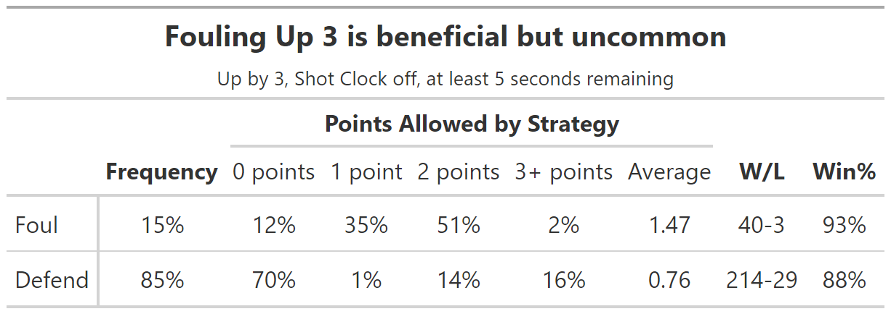
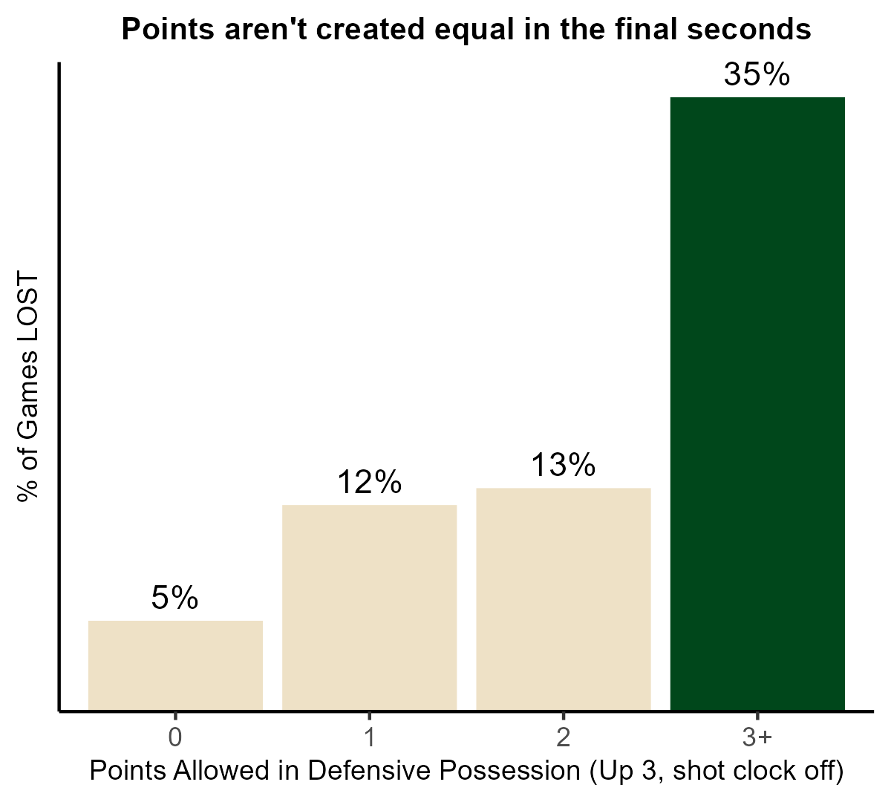

```{r setup, include=FALSE}
knitr::opts_chunk$set(echo = FALSE)
```

```{r message=FALSE, warning=FALSE, results='hide'}
library(tidyverse)
library(gt)
library(webshot2)
library(scales)

data <- read_csv("chances.csv")

# add possession start times
data <- data %>% 
  group_by(xid_possession) %>% 
  mutate(poss_start_time = max(gameClock_start)) 

# remove double counting chances and possessions starting with <5 seconds. Also set fouling in the bonus (non-shooting) as the choice to foul (for now). Make variable for if the defense won
filtered_data <- data %>% 
  mutate(valid_decision = ifelse(startType == "FGORB" | poss_start_time < 5 | outcome == "FOU_N" | outcome == "TMO" | outcome == "Out of Bounds" | outcome == "VIO", FALSE, TRUE)) %>% 
  mutate(choice_foul = ifelse(valid_decision == 1 & outcome == "FOU_B", "Foul", "Defend")) %>% 
  mutate(def_team_won = ifelse(team_nba_def == team_nba_winner, TRUE, FALSE))

# set valid possessions (possessions that go towards the "count"). Manually adjust some chances that don't fit upon video review
valid_poss <- filtered_data %>% 
  mutate(valid_decision = ifelse(xid_possession == "362830ae-c351-5fca-a90e-4cca79f2a62e", FALSE, valid_decision)) %>% 
  mutate(valid_decision = ifelse(xid_chance == "19f838c7-adeb-5640-b665-b27c991831c7", FALSE, valid_decision)) %>% 
  filter(valid_decision == TRUE) %>% 
  mutate(choice_foul = ifelse(xid_possession %in% c("d9a43033-2e0a-5cb7-acd8-39aa9b7e3199", "209b406c-6c7d-5307-a74a-941349be17ec", "fadcb1e8-9afc-566f-8315-47b204abbb86", "8b4dec8f-ede7-5bc3-b446-415af9d1bd54"), "Foul", choice_foul))

points_conceded <- valid_poss %>% 
  mutate(shot_qSP = as.double(shot_qSP)) %>% 
  group_by(xid_possession) %>% 
  arrange(desc(gameClock_start)) %>% 
  slice_tail(n = 1) %>% # take final action in possession
  group_by(choice_foul, ptsScored_team) %>% 
  summarise(n = n(), qeFG = mean(shot_qSP, na.rm = T), ptsAllowed = mean(ptsScored_team), wins = sum(def_team_won), win_pct = wins/n)

strategy_avg_points <- valid_poss %>% 
  group_by(xid_possession) %>% 
  arrange(desc(gameClock_start)) %>% 
  slice_tail(n = 1) %>% # take final action in possession
  group_by(choice_foul) %>% 
  summarise(Average = round(mean(ptsScored_team),2)) %>% 
  rename(Strategy = choice_foul)

strategy_w_l <- valid_poss %>% 
  group_by(xid_possession) %>% 
  slice(1) %>% 
  ungroup() %>% 
  group_by(choice_foul, def_team_won) %>% 
  count() %>% 
  group_by(choice_foul) %>% 
  mutate(opportunities = sum(n)) %>% 
  filter(def_team_won == TRUE) %>% 
  mutate(win_pct = scales::percent(n / opportunities),
         losses = opportunities - n) %>% 
  mutate(`W/L` = glue::glue(n,"-",losses)) %>% 
  ungroup() %>% 
  mutate(Frequency = scales::percent(opportunities/sum(opportunities))) %>% 
  select(Strategy = choice_foul, Frequency, `W/L`, `Win%` = win_pct) %>% 
  arrange(desc(Strategy))

strategy_points_allowed <- points_conceded %>% 
  select(-qeFG, -ptsAllowed, -win_pct, -wins) %>% 
  group_by(choice_foul) %>% 
  mutate(opportunities = sum(n)) %>% 
  mutate(Freq = n/opportunities) %>% 
  mutate(ptsScored_team = paste0(ptsScored_team, " points")) %>% 
  select(-n) %>% 
  pivot_wider(names_from = "ptsScored_team", values_from = "Freq") %>% 
  mutate_all(., ~coalesce(., 0)) %>% 
  mutate(`3+ points` = `3 points` + `4 points`) %>% 
  select(-`3 points`, -`4 points`) %>% 
  mutate(across(matches("point"), ~scales::percent(.))) %>% 
  select(-opportunities, `1 point` = `1 points`, Strategy = choice_foul)

strategy_w_l %>% 
  left_join(strategy_points_allowed) %>% 
  left_join(strategy_avg_points) %>% 
  select(Strategy, Frequency, matches("point"), Average, `W/L`, `Win%`) %>% 
  gt(rowname_col = "Strategy") %>% 
  tab_header(title = md("**Fouling Up 3 is beneficial but uncommon**"),
             subtitle = "Up by 3, Shot Clock off, at least 5 seconds remaining") %>% 
  cols_align(align = "center", columns = -"Strategy") %>% 
  tab_spanner(label = "Points Allowed by Strategy",
              columns = c(matches("point"), "Average")) %>% 
  tab_style(style = cell_text(weight = "bold"),
            locations = cells_column_labels(columns = c("Frequency", "W/L", "Win%"))) %>%
    tab_style(style = cell_text(weight = "bold"),
            locations = cells_column_spanners()) %>%
  gtsave("everything_table.png")
```
## Main Takeaways:
* "Intentional Fouling" is the better strategy. Boosting Win% by **5%** compared to "Defending"
* Despite this, teams chose to "Defend" nearly 6x more

{width=72%}

## "Fouling" allows more points on average. How can it be the best strategy?
* The "Defending" strategy is 8x more likely to lose the lead (allowing 3+ points)
* Allowing 3+ points is nearly 3x worse than giving up 2 points (Lose 35% of the time vs. 13%)

```{r}
plot <- points_conceded %>% 
  ungroup() %>% 
  mutate(ptsScored_team = ifelse(ptsScored_team >=3, "3+", as.character(ptsScored_team))) %>% 
  group_by(ptsScored_team) %>% 
  summarise(n = sum(n), wins = sum(wins)) %>% 
  mutate(win_pct = wins/n) %>% 
  mutate(lose_pct = 1 - win_pct) %>% 
  mutate(fill = ifelse(ptsScored_team == "3+", "#00471B", "#EEE1C6")) %>% 
  ggplot(aes(x = ptsScored_team, y = lose_pct, fill = fill)) + #color related to Y
  geom_bar(stat = "identity") +
  scale_fill_identity(guide = "legend") +
  geom_text(aes(label = scales::percent(lose_pct, 1)), vjust = -0.5) +
  scale_y_continuous(labels = percent, expand = c(0,0), limits = c(0, 0.37)) +
  labs(x = "Points Allowed in Defensive Possession (Up 3, shot clock off)",
       y = "% of Games LOST",
       #subtitle = "Teams LOSE 35% of the time when they allow 3+ points",
       title = "Points aren't created equal in the final seconds") +
  theme_classic() +
  theme(legend.position = "none",
        plot.title = element_text(face = "bold", hjust = 0.5, size = 10),
        plot.subtitle = element_text(face = "italic", hjust = 0.5, size = 9),
        axis.title = element_text(size = 9),
        axis.text.y = element_text(face = "bold"),
        panel.background = element_blank(),
        axis.ticks.y = element_blank(),
        axis.text.y.left = element_blank()) 
ggsave(plot = plot, file = "points_allowed_lose_pct.png", width = 4, height = 3.6)
```




# FAQs

### What is included in the analysis?
We take all possessions in the last 3 Regular Seasons starting with at least 5 seconds remaining where the defense is up 3 with the shot clock off in the 4th Quarter or Overtime. Each possession can only count toward one *opportunity* to avoid double-counting. Each opportunity is deemed either "Fouling" or "Defending." 

### Why are possessions starting with less than 5 seconds excluded?
These possessions are excluded because a defense may not have enough time to implement their intentional foul strategy. Risk of a three-point shooting foul is at its peak in these moments, the worst possible outcome, so it is unwise to foul in these scenarios. 5 seconds is the threshold where shooting fouls become as common as "bonus" fouls.

### What is deemed an intentional foul?
Any possession that results in Bonus free throws. Shooting fouls that were deemed to be "intentional fouling gone wrong" by video review are also included. For example, a defender may take a hack at the offensive player's arm, but the savvy shooter is loading up and earns the continuation foul.

### How often does intentional fouling "fail" and lead to 3 free throws (or a 4 point play)?
This has happened in only 4 out of the 43 intentional foul attempts (9% risk). 

### Intentional Fouling has led to losses only 3 times. What happened?
* Luka successfully retrieves his own missed free throw in the "I need a recovery beer" game
* Lillard clutches 4 Free Throws while the Pelicans turn the ball over
* Wizards foul too late, give up 4 point play to Kennard

### Which teams prefer each strategy?
The Mavericks and Suns were the only teams to intentionally foul at least half of the time. 15 teams never chose to intentionally foul in the last 3 seasons including us (the Bucks) who "defended" all 9 opportunities.

### How can this project be improved?
Several data points could improve this project. The most important is probably an "overtime" variable. I would argue that a strategy that wins in regulation is better than one that wins in overtime. For example, maybe teams who "Defend" have won in overtime 70% of the time. This would mean they are probably getting lucky in their results and we would expect the strategy to be worse than it appears to be. The given data led me to take an "outcome based" approach instead of going the "expected" route. Having players' free throw percentages and pregame win probabilities would also help in taking an "expected" approach that would do a better job at estimating the true merit of each strategy, albeit losing interpretability. 